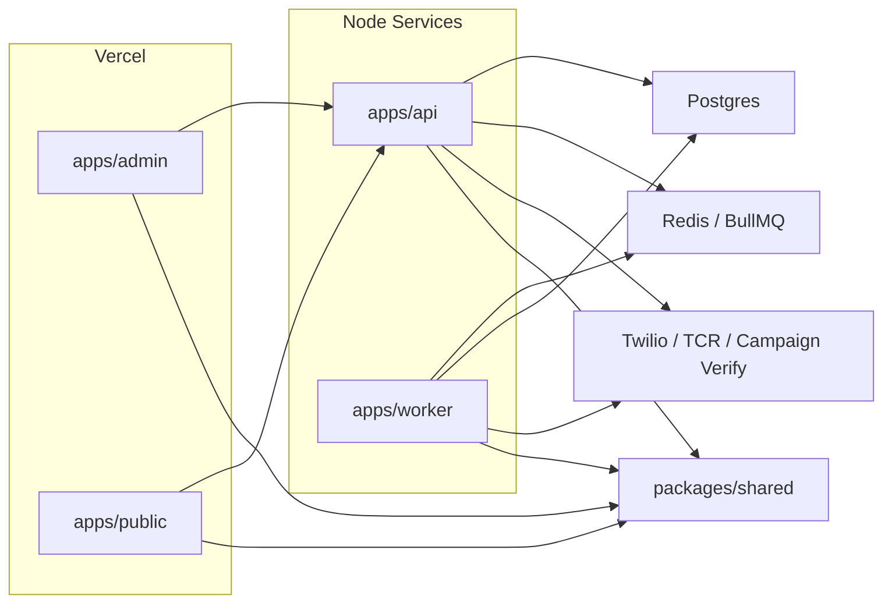
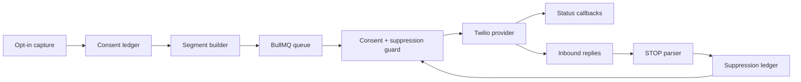
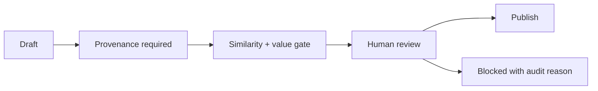

# Architecture

```mermaid
flowchart LR
  subgraph "Vercel"
    Admin["apps/admin"]
    Public["apps/public"]
  end
  subgraph "Node Services"
    API["apps/api"]
    Worker["apps/worker"]
  end
  Shared["packages/shared"]
  DB["Postgres"]
  Redis["Redis / BullMQ"]
  Twilio["Twilio / TCR / Campaign Verify"]

  Admin --> API
  Public --> API
  API --> DB
  API --> Redis
  Worker --> Redis
  Worker --> DB
  Worker --> Twilio
  API --> Twilio
  Admin --> Shared
  Public --> Shared
  API --> Shared
  Worker --> Shared
```

```mermaid
flowchart LR
  OptIn["Opt-in capture"] --> Ledger["Consent ledger"]
  Ledger --> Segment["Segment builder"]
  Segment --> Queue["BullMQ queue"]
  Queue --> Guard["Consent + suppression guard"]
  Guard --> Provider["Twilio provider"]
  Provider --> Events["Status callbacks"]
  Provider --> Inbound["Inbound replies"]
  Inbound --> Stop["STOP parser"]
  Stop --> Suppression["Suppression ledger"]
  Suppression --> Guard
```

```mermaid
flowchart LR
  Draft["Draft"] --> Provenance["Provenance required"]
  Provenance --> Similarity["Similarity + value gate"]
  Similarity --> Review["Human review"]
  Review --> Publish["Publish"]
  Review --> Blocked["Blocked with audit reason"]
```

